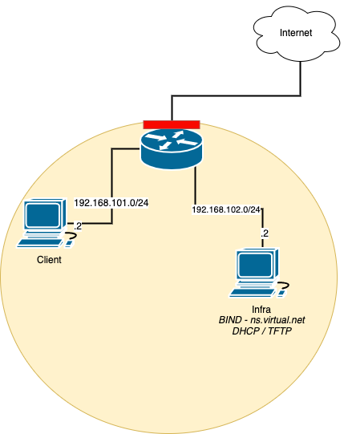

# Virtual playground

Restrictions:
* Currently only supports VirtualBox Vagrant provider
* Pausing/Suspending VMs will shift the VM time which potentially causes issues
  (e.g. with DNSSEC on 'infra' host). Destroy and redeploy the VM if time has
  shifted too much.


Requirements:
* Access to `dns_forwarders` (8.8.8.8, 8.8.4.4) via port 53. Adjust
  `dns_forwarders` to list your local DNS server if port 53 is blocked.



## Kubernetes

First start up the infrastructure components:
```
vagrant up router
vagrant up infra
```

### Talos

`vagrant up /kubernetes-talos/` - bring up all kubernetes hosts
